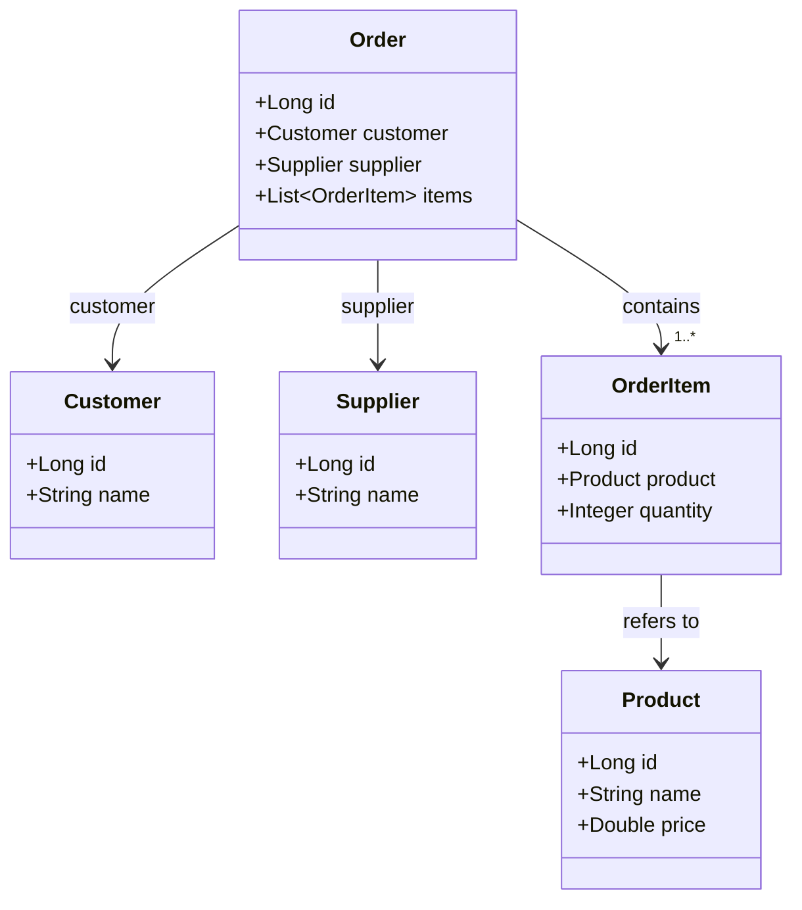

# Requisitos

Crie uma página que liste todos os pedidos realizados com os seguintes campos:
- Número do pedido (id)
- Nome do comprador
- Nome do fornecedor
- Total de produtos comprados
- Valor total comprado

**BONUS** - Ao clicar na linha do pedido, abrir os produtos desse pedido com os seguintes campos:
- Nome do produto;
- Quantidade comprada;
- Valor total do produto;

Recomendações
- Utilizar Sprint Boot, Angular e Hibernate;
- Retornar os dados para que possa instalar em outra máquina para realizar os testes.

# Instruções para clonar e executar o projeto
## Pré-requisitos
Antes de começar, certifique-se de ter instalado em seu sistema:
- Git
- Docker
- Docker Compose

## Passos para executar o projeto
### 1. Clone o repositório
```bash
git clone https://github.com/samversiane/orders-app.git
cd orders-app
```
### 2. Execute o projeto usando Docker Compose
```bash
docker-compose up -d
```
Este comando irá:
- Construir as imagens necessárias (backend Spring Boot e frontend Angular)
- Configurar o banco de dados
- Iniciar todos os serviços definidos no arquivo docker-compose.yml

### 3. Verificação
Após a conclusão do processo, o projeto estará disponível em:
- Frontend (Angular): [http://localhost:4200](http://localhost:4200)
- Backend (Spring Boot): [http://localhost:8080](http://localhost:8080)

### 4. Encerrar a execução
Para parar todos os serviços
```bash
docker-compose down
```

# Diagrama de Classes
