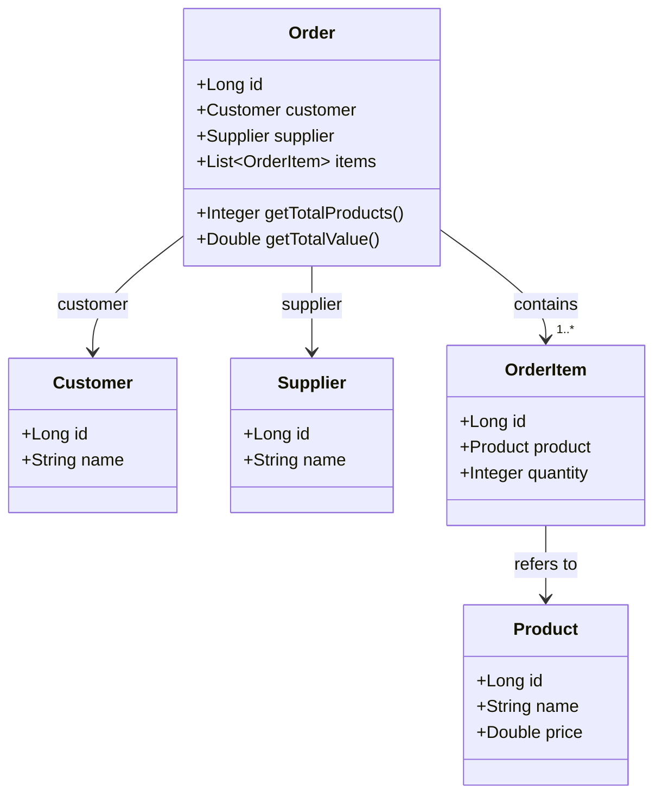

Crie uma página que liste todos os pedidos realizados com os seguintes campos:
- Número do pedido (id)
- Nome do comprador
- Nome do fornecedor
- Total de produtos comprados
- Valor total comprado

**BONUS** - Ao clicar na linha do pedido, abrir os produtos desse pedido com os seguintes campos:
- Nome do produto;
- Quantidade comprada;
- Valor total do produto;

Recomendações
- Utilizar Sprint Boot, Angular e Hibernate;
- Retornar os dados para que possa instalar em outra máquina para realizar os testes.

